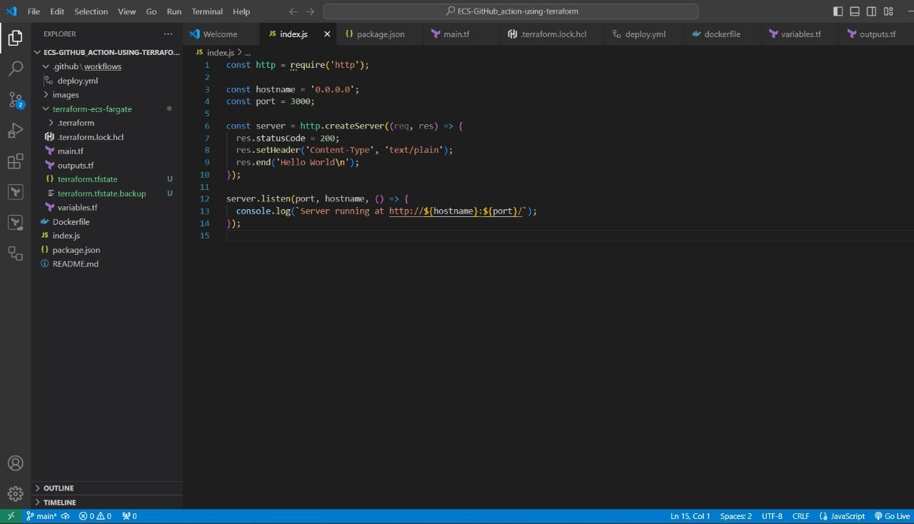
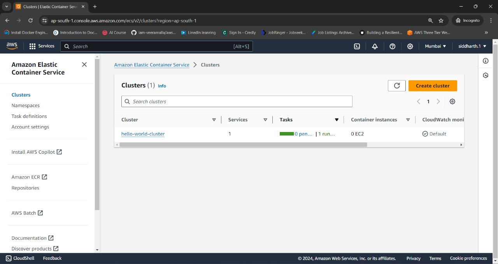
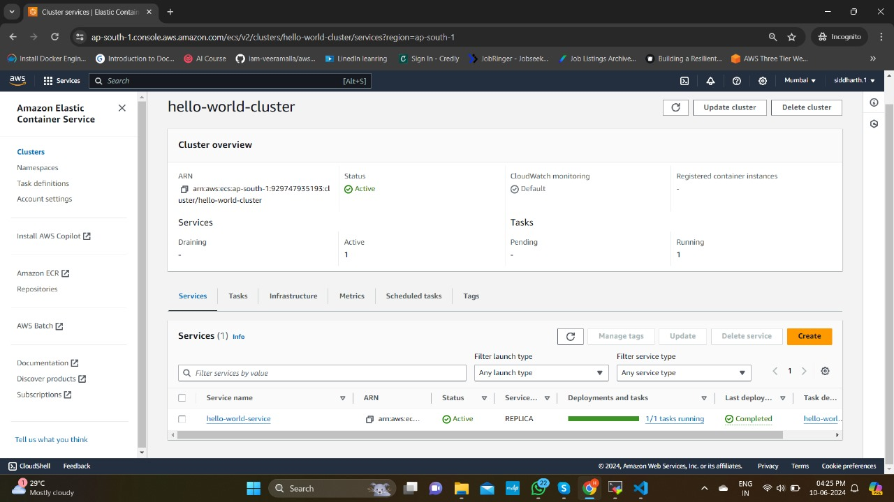
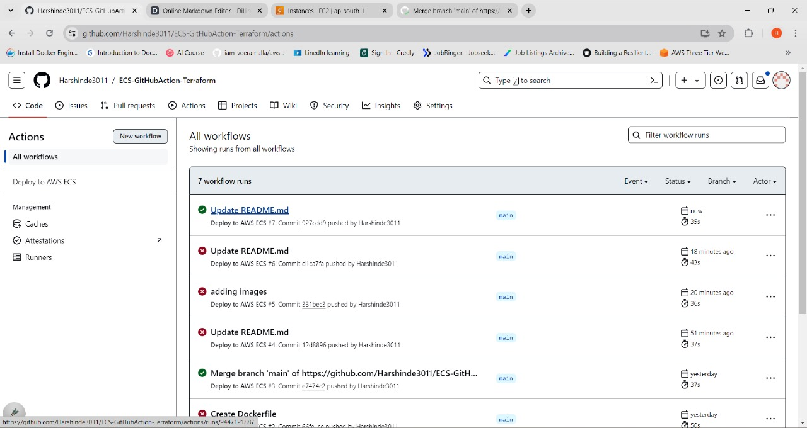
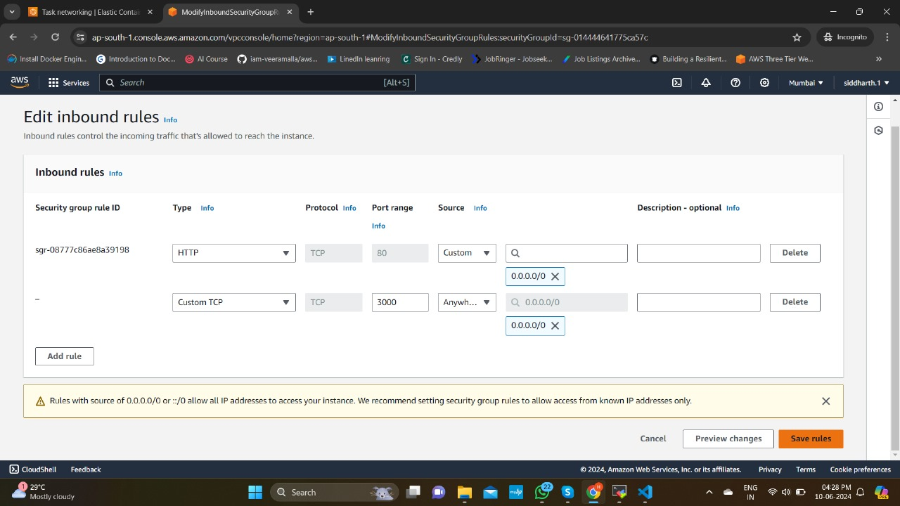
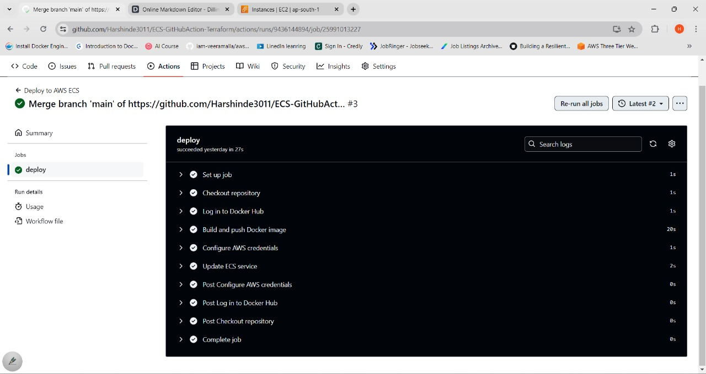
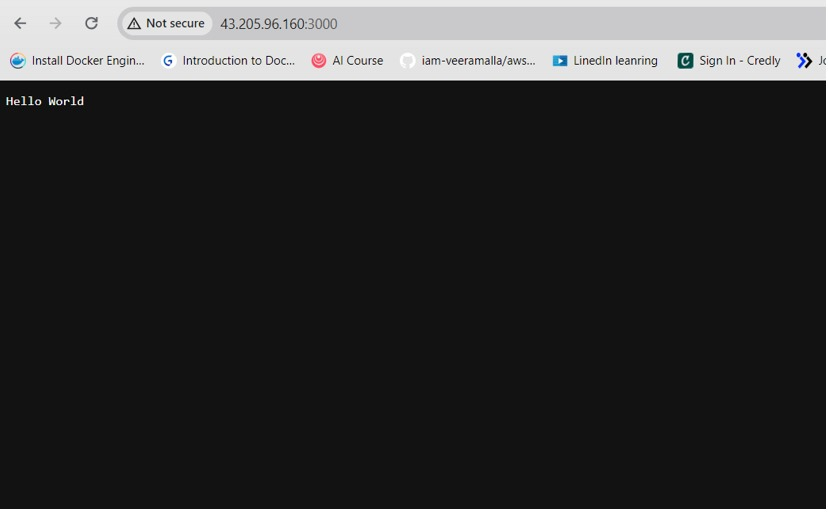

# ECS-GitHubAction-Terraform
Here I create ECS cluster using terrafrom(IaC), after that I create simple nodejs application and deploy on ECS using GitHub Action

# Build Infra using Terraform and Deploy using GitHub action

## Prerequisites

- AWS account
- Terraform installed
- AWS CLI
- GitHub account
- Docker installed
- Node.js installed

## Project Structure

- `.github/workflows/deploy.yml`: GitHub Actions workflow for CI/CD.
- `index.js`: Simple Node.js application.
- `Dockerfile`: Dockerfile for building the Node.js application.
- `terraform-ecs-fargate/main.tf`: Terraform configuration file.



## Setup Instructions

### 1. Clone the Repository

```bash
git clone https://github.com/Harshinde3011/ECS-GitHubAction-Terraform.git
cd ECS-GitHubAction-Terraform
```
### 2. Set Up Terraform

```bash
terraform init
terraform plan
terraform apply
```
### Generated ECS Using Terraform


### Generated ECS Services of ECS cluster



### 3. Set Up GitHub Secrets

Go to your GitHub repository, then Settings > Secrets and variables > Actions > New repository secret. Add the following secrets:
```bash
DOCKER_HUB_USERNAME: Your Docker Hub username.
DOCKER_HUB_ACCESS_TOKEN: Your Docker Hub access token.
AWS_ACCESS_KEY_ID: Your AWS access key ID.
AWS_SECRET_ACCESS_KEY: Your AWS secret access key.
```
### 4. GitHub Actions Workflow
##### The workflow defined in .github/workflows/deploy.yml will build and push the Docker image to Docker Hub and update the ECS service on each push to the main branch.


### 5. Edit Security Group (allow 3000)


#### Successful workflow


### 6. Access the Application
##### After deployment, you can access the application using the public IP of the ECS Fargate task.

- Go to the Amazon ECS Console.
- Select the hello-world-cluster.
- Under the Tasks tab, select the running task.
- Find the ENI ID and click to view details.
- The public IP address will be listed there. Access the application using http://PUBLIC_IP:3000.
 
### 7. After completion of all configuration, just browse Instance PublicIP:port (eg. 34.1.45.200:3000)



# Conclusion
This project sets up a basic CI/CD pipeline using GitHub Actions to deploy a Node.js application to AWS ECS Fargate using Terraform.
